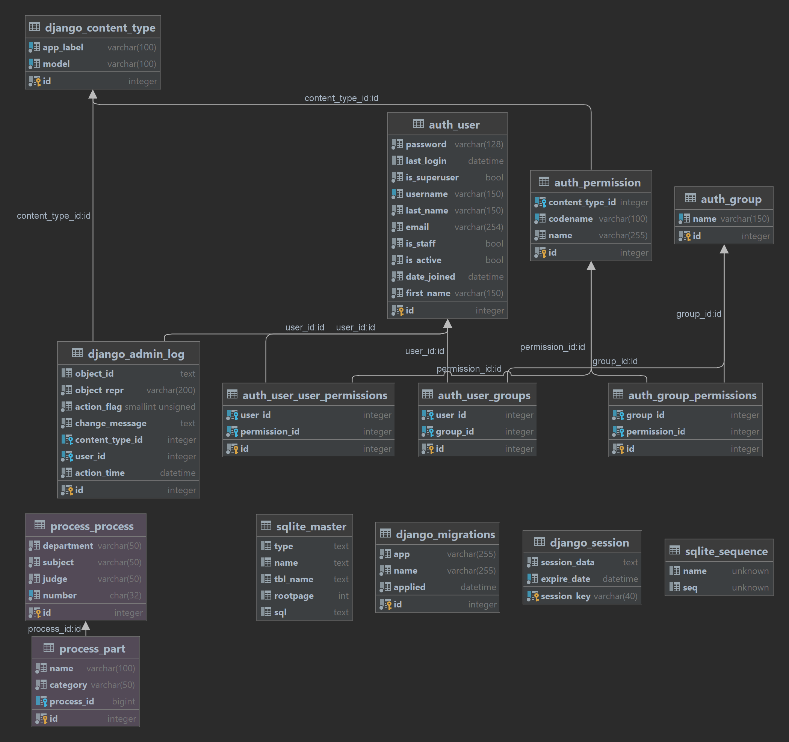

<!-- PROJECT LOGO -->
<br />
<p align="center">
  <h3 align="center">Retake Challenge</h3>

  <p align="center">
    The project is also available on Docker Hub.
    <br />
    <a href="https://hub.docker.com/repository/docker/eduardoh03/desafio-retake">Docker Hub</a>


</p>


<!-- TABLE OF CONTENTS -->
<details open="open">
  <summary>Summary</summary>
  <ol>
    <li>
      <a href="#about-the-project">About The Project</a>
      <ul>
        <li><a href="#built-with">Built With</a></li>
      </ul>
    </li>
    <li>
      <a href="#getting-started">Getting Started</a>
      <ul>
        <li><a href="#prerequisites">Prerequisites</a></li>
        <li><a href="#installation">Installation</a></li>
      </ul>
    </li>
<li><a href="#endpoint">Endpoint</a></li>
    <li><a href="#contact">Contact</a></li>
  </ol>
</details>


<!-- ABOUT THE PROJECT -->

## About The Project

This project was created to serve as a challenge for a vacancy in the company Retake. It is a simple system that should
only have CRUD requests from two entities (Process and Parties)

Here is the diagram of the entire project.



* Back Background --> Are Standard Django Templates.

* Violet Background --> Models made by Me.

### Built With

Tools used in the creation of this project.

* [Bootstrap](https://getbootstrap.com)
* [Django](https://www.djangoproject.com)
* [Python](https://www.python.org)

<!-- GETTING STARTED -->

## Getting Started

Instructions for executing code on a local machine.

### Prerequisites

This is a list of commands that must be executed for the project to run.

* Python
* Django

### Installation

        git clone https://github.com/eduardoh03/desafioRetake.git
        python -m venv env
        .\env\Scripts\Activate
        pip install -r requirements.txt  
        manage.py makemigrations
        manage.py migrate
        manage.py runserver

* Docker
   ```sh
    docker-compose build --no-cache --pull
    docker-compose up
   ```
* .env

  ```sh
  SECRET_KEY = 'django-insecure-0g=xrl55yik1pd56thmfqu*)@-upw37v_7xid21f(qx@)25d!1'
  debug = True
  ```

* Testes

  ```sh
  pytest
  ```

<!-- ENDPOINTS -->

## Endpoint

* /admin --> Is the endpoint that leads to the administrator dashboard.
* ' ' --> Is the endpoint that takes the project home screen.
* /create --> Is the endpoint that shows the process creation form plus the Parties
* /<int:process_id> --> It is the endpoint for displaying a single process, it is necessary to enter the
  id of this process.
* /update/<int:process_id> --> It is the endpoint for changing the data of a process, it is necessary to
  inform the id of that process.
* /delete/<int:process_id> --> It is the endpoint to delete a process, it is necessary to inform the id of
  that process.
* /delete_parts/<int:part_id> --> It is the endpoint to delete a single Part, it is necessary to enter the
  id of that part.
* /delete_all_parts/<int:process_id> --> It is the endpoint to delete all parties to a process, it is
  necessary to enter the process id.
* /busca --> It is the endpoint of the search screen, it displays the search result.
* /export_process_v1 --> First endpoint created to export process data.
* /export_process_v2 --> Second Endpoint created to export process data.
* /export_parts_v1 --> First Endpoint created for export of party data.
* /export_parts_v2 --> Second Endpoint created for export of party data.

<!-- CONTACT -->

## Contact

Eduardo Henrique - [@linkedin](https://www.linkedin.com/in/eduardo-henrique-a29a021b4/) - eduhenriquesrs@gmail.com

Project Link: [My repository](https://github.com/eduardoh03/eduardoh03)

